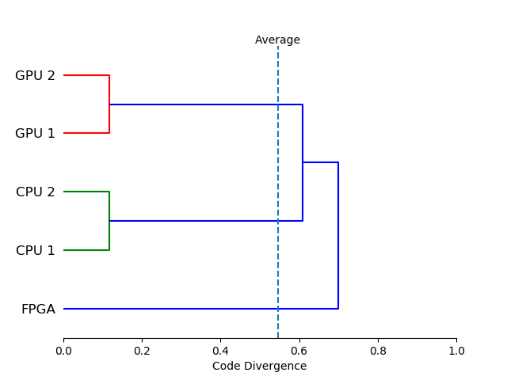

# Code Base Investigator
Code Base Investigator (CBI) is a tool designed to help developers reason about the use of _specialization_ (i.e. code written specifically to provide support for or improve performance on some set of platforms) in a code base.  Specialization is often necessary, but how a developer chooses to express it may impact code portability and future maintenance costs.

The [definition of platform](https://doi.org/10.1016/j.future.2017.08.007) used by CBI is deliberately very flexible and completely user-defined; a platform can represent any execution environment for which code may be specialized.  A platform could be a compiler, an operating system, a micro-architecture or some combination of these options.

## Code Divergence
CBI measures the amount of specialization in a code base using [code divergence](http://doi.org/10.1109/P3HPC.2018.00006), which is defined as the arithmetic mean pair-wise distance between the code-paths used by each platform.

At the two extremes, a code divergence of 0 means that all of the platforms use exactly the same code, while a code divergence of 1 means that there is no code shared between any of the platforms.  The code divergence of real codes will fall somewhere in between.

## How it Works


CBI tracks specialization in two forms: source files that are not compiled for all platforms; and regions of source files that are guarded by C preprocessor directives (e.g. `#ifdef`).  A typical run of CBI consists of a three step process:
1) Extract source files and compilation commands from a configuration file or compilation database.
2) Build an AST representing which source lines of code (LOC) are associated with each specialization.
3) Record which specializations are used by each platform.

## Usage
```
usage: codebasin.py [-h] [-c FILE] [-v] [-q] [-r DIR] [-R REPORT [REPORT ...]]

optional arguments:
  -h, --help              show this help message and exit
  -c FILE, --config FILE  configuration file
  -v, --verbose           increase verbosity level
  -q, --quiet             decrease verbosity level
  -r DIR, --rootdir DIR   working root directory
  -R REPORT [REPORT ...]  desired outout reports
```
The `codebasin.py` script analyzes a code base described in a YAML configuration file and produces one or more output reports.  Example configuration files can be found in the [examples](./examples) directory, and see the [configuration file documentation](docs/configuration.md) for a detailed description of the configuration file format.

### Summary Report
The summary report (`-R summary`) gives a high-level summary of a code base, as shown below:
```
---------------------------------------------
                      Platform Set LOC % LOC
---------------------------------------------
                                {}   2  4.88
                           {GPU 1}   1  2.44
                           {GPU 2}   1  2.44
                           {CPU 2}   1  2.44
                           {CPU 1}   1  2.44
                            {FPGA}  14 34.15
                    {GPU 2, GPU 1}   6 14.63
                    {CPU 1, CPU 2}   6 14.63
{FPGA, CPU 1, GPU 2, GPU 1, CPU 2}   9 21.95
---------------------------------------------
Code Divergence: 0.55
Unused Code (%): 4.88
Total SLOC: 41
```
Each row in the table shows the amount of code that is unique to a given set of platforms.  Listed below the table are the computed code divergence, the amount of code in the code base that was not compiled for any platform, and the total size of the code base.

### Clustering Report
The clustering report (`-R clustering`) consists of a pair-wise distance matrix, showing the ratio of platform-specific code to code used by both platforms.  These distances are the same as those used to compute code divergence.
```
Distance Matrix
-----------------------------------
      FPGA CPU 1 GPU 2 GPU 1 CPU 2
-----------------------------------
 FPGA 0.00  0.70  0.70  0.70  0.70
CPU 1 0.70  0.00  0.61  0.61  0.12
GPU 2 0.70  0.61  0.00  0.12  0.61
GPU 1 0.70  0.61  0.12  0.00  0.61
CPU 2 0.70  0.12  0.61  0.61  0.00
-----------------------------------
```

The distances can also be used to produce a dendrogram, showing the result of hierarchical clustering by platform similarity:


## Dependencies
- NumPy
- Matplotlib
- Python 3
- PyYAML
- SciPy

CBI and its dependencies can be installed using `setup.py`:
```
python3 setup.py install
```

## License
[BSD 3-Clause](./LICENSE)

## Contributing
See the [contribution guidelines](./CONTRIBUTING.md) for details.
