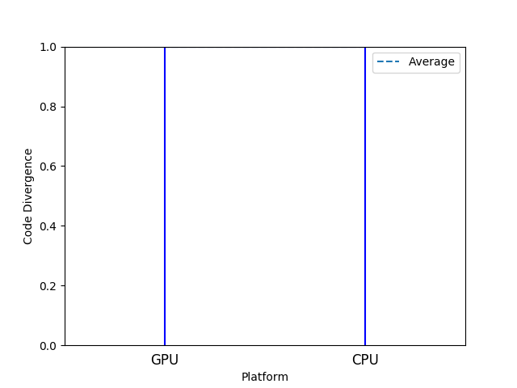

# Disjoint Source Example

An example codebase sharing no code across multiple platforms.

## Output
```
-----------------------
Platform Set LOC % LOC
-----------------------
       {GPU}  37 48.68
       {CPU}  39 51.32
-----------------------
Code Divergence: 1.00
Unused Code (%): 0.00
Total SLOC: 76

Distance Matrix
--------------
     CPU  GPU
--------------
CPU 0.00 1.00
GPU 1.00 0.00
--------------
```


