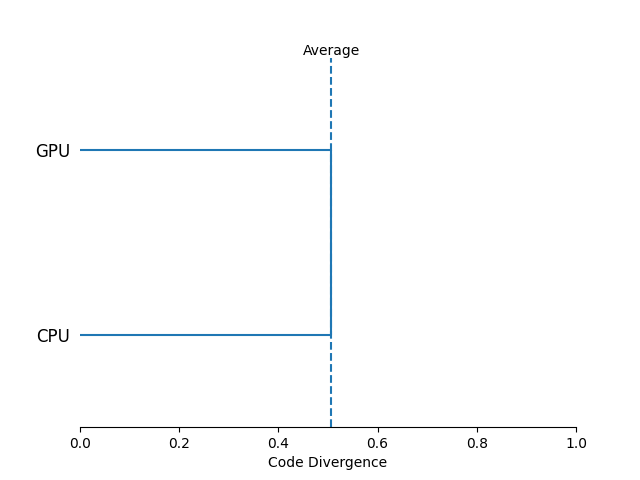

# Divergent Source Example

An example codebase specializing some small regions of code for individual platforms.

## Output
```
-----------------------
Platform Set LOC % LOC
-----------------------
          {}   1  1.39
       {GPU}  18 25.00
       {CPU}  18 25.00
  {CPU, GPU}  35 48.61
-----------------------
Code Divergence: 0.51
Unused Code (%): 1.39
Total SLOC: 72

Distance Matrix
--------------
     CPU  GPU
--------------
CPU 0.00 0.51
GPU 0.51 0.00
--------------
```


